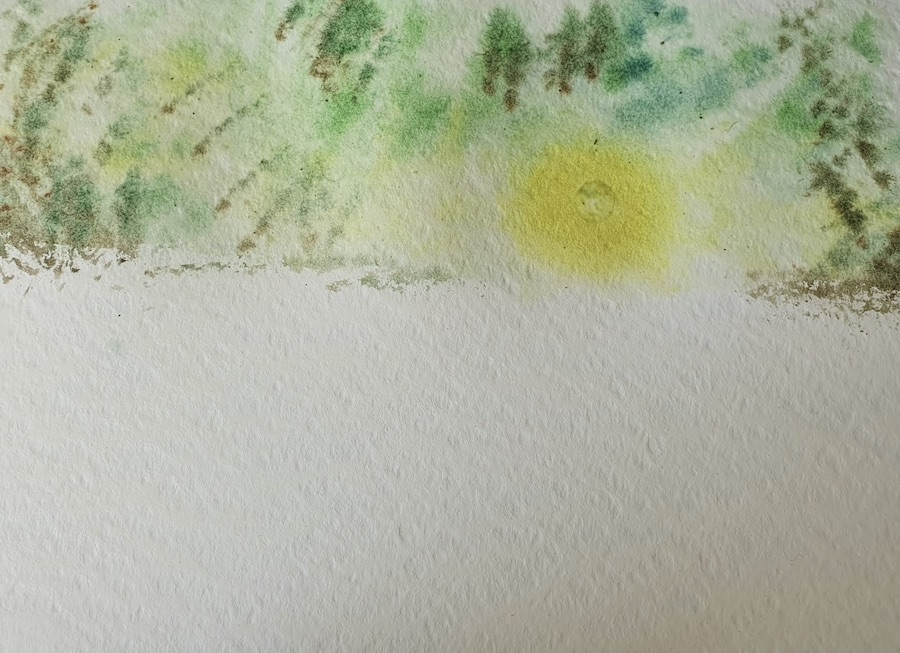
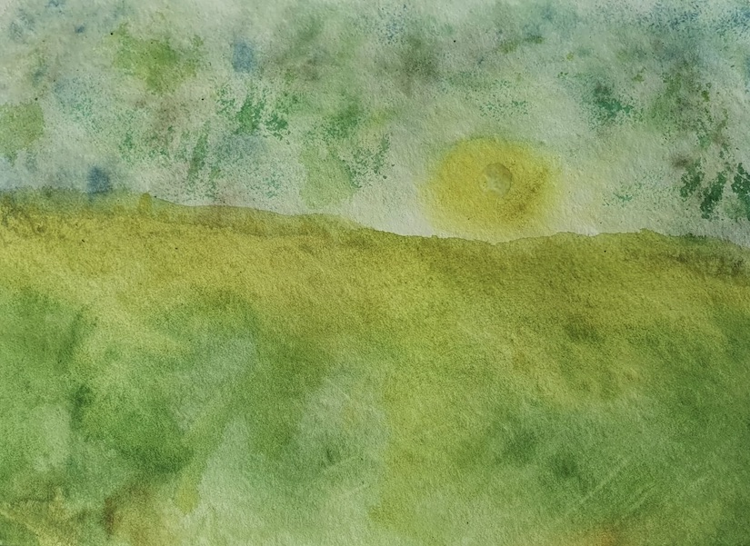
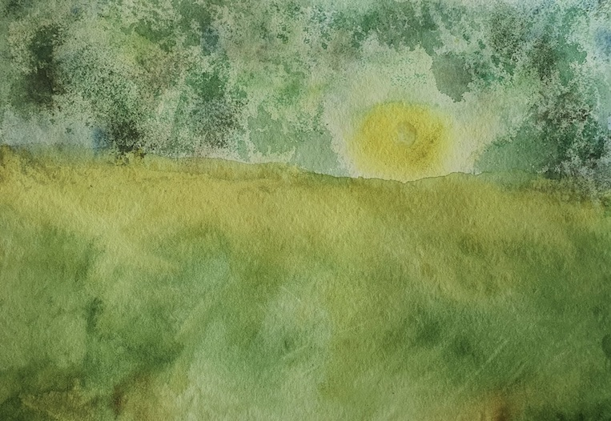
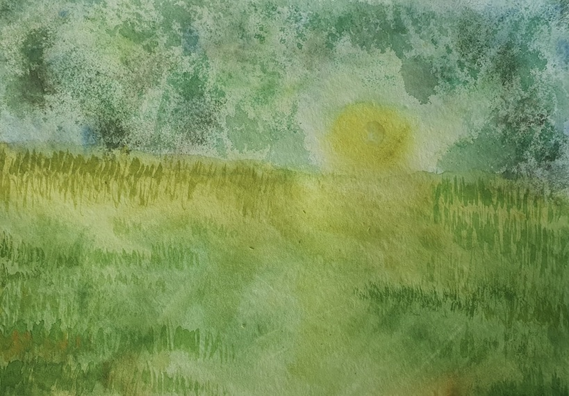
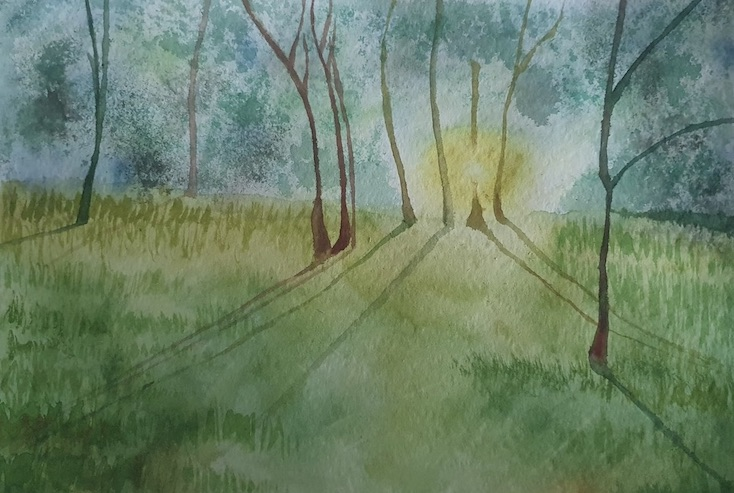

+++
title = "Rachel's Aquarell Malerei"
date = "2022-05-07"
draft = false
pinned = true
tags = ["start", "Aquarell", "Malerei", "Kunst", "grün"]
image = "1304a303-a99e-4259-9e97-81a0e314814b_1_201_a.jpeg"
description = "Liebe Leser und liebe Leserinnen \n\nHeute habe ich mich der Aquarellmalerei gewidmet und werde euch mit sechs verschiedenen Bildern meine einzelnen Prozesse aufzeigen. \n\nDie Aquarellmalerei gilt generell als sehr schwierig, dabei musste ich einfach ein paar einzelne Grundlagen lernen, die ich euch Schritt für Schritt bei jedem Bild zeigen und erläutern werde. Ich habe mich für das Malen auf dem dicken und unebenen Aquarellpapier entschieden. \n\nSeid gespannt und lasst euch inspirieren! Ich freue mich zu erfahren, wie es euch gelungen ist. \n\nEure Rachel"
footnotes = ""
+++

Liebe Leser und liebe Leserinnen 

Heute habe ich mich der Aquarellmalerei gewidmet und werde euch mit sechs verschiedenen Bildern meine einzelnen Prozesse aufzeigen. 

Die Aquarellmalerei gilt generell als sehr schwierig, dabei musste ich einfach ein paar einzelne Grundlagen lernen, die ich euch Schritt für Schritt bei jedem Bild zeigen und erläutern werde. Ich habe mich für das Malen auf dem dicken und unebenen Aquarellpapier entschieden. 

Seid gespannt und lasst euch inspirieren! Ich freue mich zu erfahren, wie es euch gelungen ist. 

1. Schritt: 

Ich habe mit dem Aufkleben eines kleinen Stickers begonnen, welcher sich mitten in der Sonne befindet. Dies um später zu vermeiden, dass die Sonne nur einen Gelbton hat. Als nächstes habe ich den oberen Teil des Bildes mit Wasser angefeuchtet. Aus dem Blau, dem Gelb und dem Grün habe ich mehrere schöne Grüntöne gemischt. Durch mehr oder weniger Farbe konnte ich die Grüntöne variieren. Jetzt beginnt das Warten, bis die Farbe trocken ist. So konnte ich jedes Mal mehrere Grüntöne übereinander schichten. Um den Sticker herum, habe ich nur Geld verwendet und darauf geachtet, dass die Sonne nicht grün wird. 

2. Schritt:

Zwischen diesen beiden Bildern ist viel passiert. Die Mitte des Bildes habe ich mich mehrheitlich für ein gelb-grün entschieden. Den unteren Teil des Bildes habe ich dann immer dunkler werden lassen, bis das Gelb von keiner grossen Bedeutung mehr war. Nun müssen wir erneut warten. Daraufhin folgte eine zweite grüne Schicht, bei der ich darauf geachtet habe, dass die dunkleren Grün-Partien sich am Rand des Bildes befinden und es unter der Sonne ein wenig heller bleibt. 

3. Schritt: 

Hier ist mir ein kleiner Fehler passiert, den ich ausgebessert habe. Mir hat es nicht gefallen, dass das Bild unten so sehr dunkel geworden ist, weshalb ich meinen Pinsel nochmal nass gemacht habe und die dunklere Farbe besser verteilt habe. Jetzt heisst es wieder, trocken lassen und abwarten. 

4. Schritt:

Damit das Bild natürlich und möglich realistisch aussieht, habe ich die Grasbüschel von rechts und links verstärkt und dabei zum Beispiel grünere Grüntöne benutzt. Die schattigen Stellen sind eher am Bildrand. Unterhalb der Sonne habe ich mit meinem nassen Pinsel wieder etwas Farbe weggenommen, weil es mir zu dunkel geworden ist. "Einfach" mit feuchtem Pinsel auswaschen und mit einem kleinen Taschentuch ein wenig abtupfen. Dies aber sehr sorgfältig. Ich finde es sehr schön zu sehen, wie ich mit meiner doch recht kleinen Farbpalette so viele Grüntöne mischen konnte. An manchen Stellen habe ich mich für ein wenig braun entschiedener allerdings nur sehr leicht dosiert. So hatte ich den Eindruck der realen Natur sehr nah zu kommen. 

5. Schritt:

Wir sind nun fast am Ende angelangt. Von der feinen Mischung der Brauntöne habe ich mir etwas abgenommen und begonnen die dünnen Baumstämme im Hintergrund, um die Sonne beginnend, zu zeichnen. Direkt unterhalb der Sonne ziehe ich direkt die Schatten. Dies mit sehr wenig Farbe und viel Wasser. Dennoch nicht zu viel, sonst verlaufen diese. Die Schatten der Bäume bewegen sich von der Sonne weg in Richtung des Bildinneren. Wichtig: gute Verbindungsstelle zwischen Wurzel und schatten herstellen, so dass es möglichst realistisch aussieht. Es soll klar zu sehen sein, wo der Baum endet und der Schatten beginnt. Die Bäume die sich Weiterweg von der Sonne befinden, habe ich etwas dunkler gemalt, da diese ja nicht direkt im Sonnenlicht stehen. Wenn sie mir dann zu dunkel geworden sind, habe ich es einfach wieder mit dem Wasser gerettet. 

6. und letzter Schritt: 

Als letztes habe ich den kleinen Sticker in der Sonne von meinem Bild langsam abgezogen. Ihr könnt nun sehen, wie das Innere der Sonne etwas heller ist, als ihr Äusseres und sie so deutlich realistischer aussieht. Achtung: Nicht vergessen den Abdruck vom Rand des Stickers mit Wasser ein bisschen mit dem Gelb drumherum zu vermischen, so dass es noch realistischer aussieht. Wir sind am Ziel angekommen, das Bild ist fertig. Ich hoffe ihr hattet Freude und euer Bild sieht so ähnlich aus wie meins! :)

😀 Viel Spass beim Nachmalen!\
\
Eure Rachel